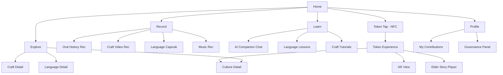

# 📱 ANQA — App Design System & Screen Details

## UI Mockup Previews — All 13 Screens

````carousel

<!-- slide -->

<!-- slide -->

<!-- slide -->

<!-- slide -->

<!-- slide -->

<!-- slide -->

<!-- slide -->

<!-- slide -->

<!-- slide -->

<!-- slide -->

<!-- slide -->

<!-- slide -->

````

---

## 1. Design System

### Brand Identity

| Element | Value |
|---------|-------|
| **Name** | ANQA (عنقاء) |
| **Tagline** | *"Cultures rise."* |
| **Personality** | Premium, warm, respectful, alive — not cold/sterile |
| **Logo Concept** | Stylized phoenix silhouette made from geometric Amazigh/cultural pattern lines, amber gold on dark |

### Color Palette

| Token | Hex | Usage |
|-------|-----|-------|
| `--bg-primary` | `#0D0D15` | Deepest background (behind modals, base) |
| `--bg-surface` | `#1A1A2E` | Card/surface background |
| `--bg-elevated` | `#252540` | Elevated cards, hover states |
| `--accent-gold` | `#D4A843` | Primary accent — buttons, icons, highlights |
| `--accent-amber` | `#E8B94A` | Hover/active state for gold elements |
| `--accent-warm` | `#C47A2A` | Secondary warm accent (badges, tags) |
| `--text-primary` | `#F5F0E8` | Main text (warm white, not pure white) |
| `--text-secondary` | `#9B9BAE` | Subtitles, captions, metadata |
| `--status-safe` | `#4CAF50` | Heritage status: safe / thriving |
| `--status-warning` | `#F4A828` | Heritage status: vulnerable |
| `--status-critical` | `#E53935` | Heritage status: critically endangered |

> **Design Philosophy**: Dark theme with warm gold accents. The warmth signals *"human, cultural, alive"* while the dark base keeps it modern and premium. **No cold blues or tech-sterile colors.**

### Typography

| Style | Font | Size | Weight |
|-------|------|------|--------|
| **Display** | Outfit | 28–32px | Bold (700) |
| **Heading** | Outfit | 20–24px | Semi-Bold (600) |
| **Body** | Inter | 15–16px | Regular (400) |
| **Caption** | Inter | 12–13px | Regular (400) |
| **Mono/Data** | JetBrains Mono | 13px | Regular (400) |

### Spacing & Radius

| Token | Value |
|-------|-------|
| Base spacing unit | `8px` |
| Card padding | `16px` |
| Card radius | `16px` |
| Button radius | `12px` |
| Section gap | `24px` |
| Screen edge margin | `20px` |

### Effects

| Effect | Implementation |
|--------|---------------|
| **Card glass** | `background: rgba(26, 26, 46, 0.7); backdrop-filter: blur(20px);` |
| **Gold glow** | `box-shadow: 0 0 20px rgba(212, 168, 67, 0.3);` |
| **Elevation** | Subtle shadow: `0 4px 24px rgba(0,0,0,0.4)` |
| **Transitions** | All interactive elements: `ease-out 200ms` |
| **Micro-animations** | Pulse on record button, shimmer on token detection, fade-in on cards |

---

## 2. Screen-by-Screen Breakdown

### Screen Map (Navigation)



---

### 🏠 Screen 1: HOME

**Purpose**: Gateway to the entire app. Inspire discovery.

| Section | Details |
|---------|---------|
| **Status bar** | ANQA logo (center), profile avatar (right), search icon |
| **Greeting** | "Good [Morning/Evening], **Discover Living Heritage**" — personalized time of day |
| **Cultural Globe** | Interactive 3D globe (Three.js / Mapbox) with glowing amber dots for active cultural communities. Tap a dot → jump to that culture's page. Slowly auto-rotates |
| **Show All** | Link above globe to full-screen map mode |
| **Heritage Tokens** | Horizontal scroll of circular token icons — each labeled with culture name + mini description. Tapping opens culture detail |
| **Recently Added** | Vertical list of newest contributions (story, craft, song) with thumbnail, title, contributor name, location |
| **Bottom Nav** | `Home` · `Explore` · `Record` (center, highlighted) · `Learn` · `Profile` |

---

### 🔍 Screen 2: EXPLORE (Archive)

**Purpose**: The living cultural library. Browse, search, filter.

| Section | Details |
|---------|---------|
| **Search bar** | Placeholder: *"Search by voice, text, or image..."* — icons for mic and camera input |
| **Filter chips** | Horizontal scroll: `All` · `Languages` · `Crafts` · `Stories` · `Music` · `Recipes` · `Rituals` |
| **Content grid** | 2-column masonry grid of cultural content cards |
| **Card anatomy** | Photo (top 60%), Title (bold), Location tag with pin icon, Endangerment dot (🟢🟡🔴), Contributor avatar (small) |
| **Sort options** | "Most Endangered" · "Recently Added" · "Most Explored" · "Near You" |
| **Empty state** | If no results: illustration of a phoenix feather + *"No heritage found. Be the first to contribute."* |

---

### 📄 Screen 3: CULTURE DETAIL

**Purpose**: Deep dive into one cultural tradition. The "soul page."

| Section | Details |
|---------|---------|
| **Hero** | Full-width photo/video with gradient overlay, culture name + region |
| **Status badge** | Endangerment level with explanation: "Critically Endangered — Fewer than 50 practitioners remain" |
| **Story section** | "The Story" — AI-summarized overview with "Read Elder's Words" expand to see original transcription |
| **Media gallery** | Horizontal scroll of photos, videos, audio clips with play buttons |
| **Knowledge threads** | Connected elements: "Related Crafts" · "Associated Language" · "Songs in this Tradition" · "Ingredients/Materials Used" |
| **Craft tutorial CTA** | Big amber button: "Learn This Craft →" |
| **Contributors** | List of community members who recorded this heritage |
| **Ask ANQA** | Floating button → opens AI companion pre-loaded with this culture's context |

---

### 🎙️ Screen 4: RECORD

**Purpose**: Empower communities to capture their own heritage.

| Section | Details |
|---------|---------|
| **Header** | "Share Your Story" — subtitle: *"Capture and preserve cultural traditions for generations to come."* |
| **Record button** | Large centered circle with pulsing amber ring — tap to start |
| **Mode grid** (2×2) | **Oral History** — voice recording with AI transcription · **Craft Technique** — video with motion tracking overlay · **Language Capsule** — word-by-word vocabulary builder · **Traditional Music** — audio with waveform visualization |
| **AI Interview toggle** | "Guided Interview Mode (AI-Assisted)" — the AI asks follow-up questions during recording |
| **Metadata form** | After recording: culture name, region, language, tags, access tier selection (Open/Guided/Protected/Sacred) |
| **Upload progress** | Amber progress ring with "Processing with AI..." status |

---

### 🧠 Screen 5: LEARN (AI Companion)

**Purpose**: Interactive learning powered by AI.

| Section | Details |
|---------|---------|
| **Tab switcher** | `AI Guide` · `Languages` · `Crafts` |
| **AI Guide (chat)** | Chat interface — user types questions, ANQA responds with rich media (text + images + video embeds + source attribution). Every response cites its source recording |
| **Language tab** | List of available endangered languages → tap → lesson flow (flashcards, pronunciation, spaced repetition) |
| **Crafts tab** | List of available craft tutorials → tap → step-by-step with video + motion capture replay |
| **Suggested questions** | Quick-tap chips: "What crafts are near me?" · "Teach me Amazigh greetings" · "Compare two traditions" |

---

### 🪙 Screen 6: HERITAGE TOKEN (NFC Tap)

**Purpose**: The X-Factor moment. Physical token triggers digital magic.

| Section | Details |
|---------|---------|
| **Trigger** | App detects NFC tap → full-screen takeover with golden particle animation |
| **Token reveal** | Large glowing token image (the actual artifact detected) with spin animation |
| **Title** | "Heritage Token Detected: **[Culture Name]**" |
| **Three actions** | Stacked amber buttons: **🎧 Listen to Elder Story** (spatial audio player) · **📱 Launch AR Craft Demo** (opens camera with AR overlay) · **📖 Explore Full Archive** (jumps to culture detail page) |
| **Background** | Subtle geometric pattern from the token's culture, slowly animated |
| **Sound** | A soft chime + ambient cultural audio fades in on detection |

---

### 📸 Screen 7: AR CRAFT DEMO

**Purpose**: Point your camera at a surface → see virtual hands performing the craft.

| Section | Details |
|---------|---------|
| **Camera view** | Full-screen AR — detects flat surface (table, floor) |
| **AR overlay** | Virtual hands/tools performing the craft technique (3D models from motion capture data) |
| **Audio narration** | AI voice explains each step on top of spatial audio ambiance |
| **Step indicator** | Bottom: "Step 2 of 7 — Preparing the clay" with progress dots |
| **Controls** | Pause, replay step, skip forward, exit |
| **Recording prompt** | "Want to try it yourself? Record your attempt →" |

---

### 👤 Screen 8: PROFILE

**Purpose**: Personal space + governance for community elders.

| Section | Details |
|---------|---------|
| **User info** | Avatar, name, role badge (Contributor / Elder / Researcher / Learner) |
| **My contributions** | Grid of content the user has recorded |
| **Learning progress** | Languages started, crafts explored, tokens collected |
| **Token collection** | Visual display of all Heritage Tokens the user has tapped (like a badge wall) |
| **Settings** | Language preference, offline downloads, notification prefs |
| **Elder-only: Governance** | Access request queue, content moderation, access tier management |

---

## 3. Key UI Patterns

### Glassmorphism Cards
```css
.card {
  background: rgba(26, 26, 46, 0.65);
  backdrop-filter: blur(20px);
  border: 1px solid rgba(212, 168, 67, 0.15);
  border-radius: 16px;
}
```

### Gold Accent Button
```css
.btn-gold {
  background: linear-gradient(135deg, #D4A843, #C47A2A);
  color: #0D0D15;
  font-weight: 600;
  border-radius: 12px;
  padding: 14px 28px;
  box-shadow: 0 4px 16px rgba(212, 168, 67, 0.35);
  transition: transform 0.2s ease, box-shadow 0.2s ease;
}
.btn-gold:active {
  transform: scale(0.97);
  box-shadow: 0 2px 8px rgba(212, 168, 67, 0.5);
}
```

### Endangerment Status Dot
```css
.status-dot {
  width: 10px;
  height: 10px;
  border-radius: 50%;
  animation: pulse 2s infinite; /* only for critical */
}
.status-safe    { background: #4CAF50; }
.status-warning { background: #F4A828; }
.status-critical { background: #E53935; }
```

### Token Detection Animation
```css
@keyframes token-glow {
  0%   { box-shadow: 0 0 20px rgba(212, 168, 67, 0.2); }
  50%  { box-shadow: 0 0 60px rgba(212, 168, 67, 0.6); }
  100% { box-shadow: 0 0 20px rgba(212, 168, 67, 0.2); }
}
```

---

## 4. Design Prompts for Additional Screens

Use these prompts to generate more screens if needed:

### Language Lesson Screen
> Mobile app UI, dark theme (#0D0D15), amber gold accents (#D4A843). Language learning screen for an endangered Amazigh language. Shows a flashcard in the center with the Tifinagh script character, romanized pronunciation below, English translation, a speaker icon to hear pronunciation, and "Got it" / "Review again" buttons. Progress bar at top showing "3 of 15 words". Bottom has a streak counter "🔥 5 day streak". Modern, clean, Duolingo-level polish. No device frame.

### Community Governance Panel
> Mobile app UI, dark premium theme (#1A1A2E), amber accents. An "Elder Governance" screen showing: a list of pending access requests (researcher name, institution, reason, requested content) each with "Approve" (green) and "Deny" (red) buttons. Below that, a "Content Moderation" section showing recently uploaded items awaiting review with thumbnails and "Publish" / "Flag" actions. Clean, respectful interface with shield icon in header. No device frame.

### Cultural Map Full Screen
> Mobile app UI, dark theme. A full-screen interactive world map (Mapbox dark style) with glowing amber dots of varying sizes showing cultural heritage density. Tap a region to zoom in. A bottom sheet slides up showing "3 cultures in this area" with preview cards. Filter tabs at top: "Languages" "Crafts" "Music". A "Near Me" floating button with location icon. Elegant, immersive, premium feel. No device frame.

### Onboarding Flow
> Mobile app onboarding screen, dark premium theme (#0D0D15), amber gold (#D4A843). First slide of 3 — shows a large illustration of a golden phoenix rising from geometric cultural patterns. Title: "Cultures Rise." Subtitle: "ANQA preserves endangered heritage through AI and community — so no tradition is lost forever." Dot indicators (1 of 3) and "Get Started" button at bottom. Minimal, emotional, premium. No device frame.

---

## 5. Animation & Interaction Specs

| Interaction | Animation |
|-------------|-----------|
| **App launch** | Phoenix logo rises from bottom → fades into home screen |
| **Globe rotation** | Continuous slow spin; accelerates on swipe, decelerates with inertia |
| **Card appear** | Fade-in + slide-up (stagger 50ms per card) |
| **Token NFC tap** | Full-screen flash → golden particles radiate outward → token spins into center (800ms) |
| **Record button** | Pulse ring expands/contracts at 1Hz when idle; solid amber when recording with audio waveform ring |
| **AI typing** | Amber dots (...) typing indicator, message fades in with gentle slide |
| **Endangerment critical** | Status dot pulses slowly (2s cycle) to draw attention |
| **Heritage Token collected** | Stamp animation — coin presses into the collection with a satisfying "thunk" haptic feedback |
| **AR launch** | Camera opens with scanning grid overlay → grid dissolves when surface detected |
